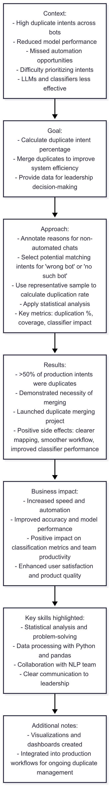
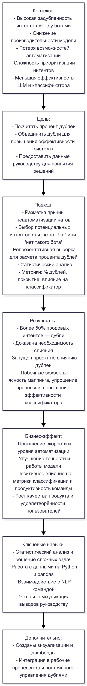

# Duplicate Intent Analysis for Chatbots

---

## 🇬🇧 English version

**Timeline:** Q2 2025  
**Role:** Researcher (IA team, working closely with NLP)  
**Tech stack:** Python • pandas • statistics • basic math  

### Context  
The chatbot system had a high level of duplicate intents across different bots, causing multiple problems:  
- Reduced model performance and accuracy.  
- Missed opportunities for automation in production.  
- Difficulty prioritizing intents due to unclear mappings.  
- LLMs and new classifiers were less effective.  

Business analysts initially did not see the need for merging duplicates, so we had to quantify the problem with clear percentages to justify the project.

### Goal  
- Calculate the percentage of duplicate intents to demonstrate the need for merging.  
- Merge duplicate intents to improve overall system efficiency.  
- Provide clear data to support the initiative to senior leadership.

### Approach  
- Annotated reasons for non-automated chats. For chats marked as “intent belongs to another bot” or “no such bot,” we selected potential matching intents.  
- Used a representative sample and calculated the proportion of chats that could map to multiple bots. This proportion represented the duplication rate.  
- Applied strong statistical analysis to validate findings.  
- Key metrics:  
  - Duplication percentage  
  - Coverage of automated responses  
  - Impact on accuracy of intents and classifier performance  

### Results  
- Calculated that over 50% of production intents were duplicates.  
- Demonstrated the necessity of merging to leadership.  
- Launched the duplicate merging project, which is now actively improving intent accuracy and automation.  
- Positive side effects: improved clarity in intent mapping, smoother workflow, and more efficient classifier performance.

### Business Impact  
- Increased speed of work and level of automation.  
- Improved accuracy of intents and overall model performance.  
- Positive impact on classification metrics and team productivity.  
- Overall enhancement of user satisfaction and product quality.

### Key Skills Highlighted  
- Statistical analysis and problem-solving.  
- Data processing with Python and pandas.  
- Collaboration with NLP team for actionable insights.  
- Clear communication of technical findings to leadership.  

### Additional Notes  
- Visualizations and dashboards were created to illustrate duplicate percentages and mapping logic.  
- Project has been integrated into production workflows for ongoing duplicate management.

### Data Pipeline

---

## 🇷🇺 Русский вариант

**Таймлайн:** Q2 2025  
**Роль:** Исследователь (команда IA, в сотрудничестве с NLP)  
**Технологии:** Python • pandas • статистика • базовая математика  

### Контекст  
В системе чатботов наблюдалась высокая задубленность интентов между разными ботами, что приводило к:  
- Снижению производительности и точности модели.  
- Потере возможностей для автоматизации в продакшне.  
- Сложностям с приоритизацией интентов из-за неясной структуры.  
- Меньшей эффективности LLM и нового классификатора.  

Бизнес-аналитики изначально не видели необходимости слияния дублей, поэтому требовалось количественно подтвердить проблему с помощью точных процентов.

### Цель  
- Посчитать процент задубленности интентов для обоснования задачи слияния.  
- Объединить дубли для улучшения работы системы.  
- Предоставить руководству точные данные для принятия решения.

### Подход  
- Разметили причины неавтоматизации чатов. Для чатов с отметками «намерение подходит к другому боту» или «нет такого бота» подобрали потенциальные интенты.  
- Выбрали репрезентативную выборку и посчитали долю строк, подходящих к нескольким ботам — это и есть процент дублей.  
- Применили статистический анализ для проверки результатов.  
- Метрики:  
  - Процент задубленности интентов  
  - Покрытие автоматизированных ответов  
  - Влияние на точность интентов и работу классификатора  

### Результаты  
- Выяснили, что более 50% продовых интентов являются дублями.  
- Доказали необходимость слияния дублей руководству.  
- Запущен проект по слиянию дублей, который уже улучшает точность интентов и автоматизацию.  
- Положительные побочные эффекты: ясность маппинга интентов, упрощение процессов, повышение эффективности классификатора.

### Бизнес-эффект  
- Повышение скорости работы и уровня автоматизации.  
- Улучшение точности интентов и общей работы модели.  
- Позитивное влияние на метрики классификации и продуктивность команды.  
- Рост качества продукта и удовлетворённости пользователей.

### Ключевые навыки  
- Статистический анализ и решение сложных задач.  
- Работа с данными на Python и pandas.  
- Взаимодействие с командой NLP для получения практических инсайтов.  
- Чёткая коммуникация технических выводов руководству.

### Дополнительно  
- Созданы визуализации и дашборды для демонстрации процента дублей и логики маппинга.  
- Проект интегрирован в рабочие процессы для постоянного управления дублями.

### Пайплайн

